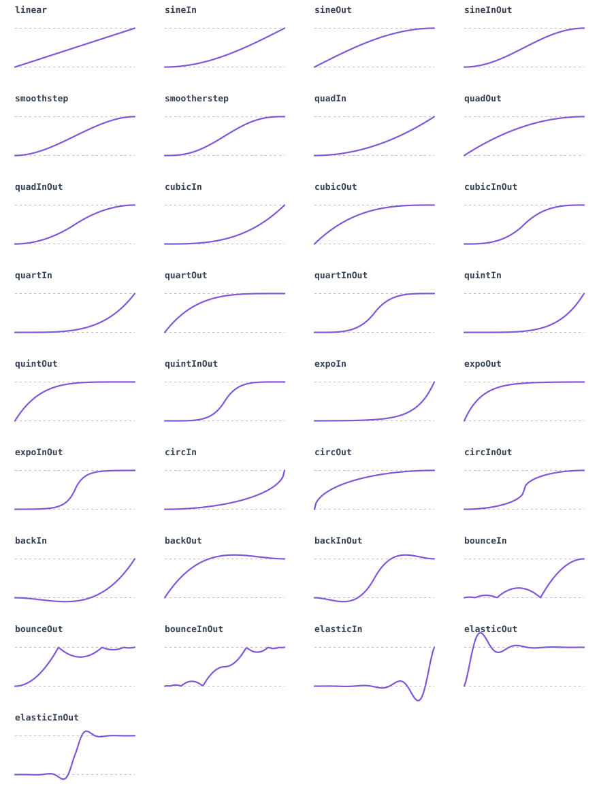

# @bluehexagons/easing

Small, dependency-free easing functions for JavaScript and TypeScript. The package ships tree-shakeable ESM, CommonJS, and declarations for both module systems.



## Install

```sh
npm install https://codeload.github.com/bluehexagons/easing/tar.gz/refs/tags/v0.5.1
```

## Use

```ts
import {
  createElasticInOut,
  cubicBezier,
  ease,
  quadInOut,
  spring
} from '@bluehexagons/easing';

quadInOut(0.5);                    // 0.5
ease(quadInOut, 0.5, 20, 100);    // 60
cubicBezier(0.25, 0.1, 0.25, 1);  // CSS `ease`
createElasticInOut({ amplitude: 1.5, period: 0.4 });
spring({ stiffness: 120, damping: 14 });
```

CommonJS uses the same API:

```js
const { ease, quadInOut } = require('@bluehexagons/easing');
```

Easing functions accept normalized time, usually from `0` to `1`. Values outside that range are extrapolated when the curve's math permits it. Overshooting curves can return values outside `[0, 1]`; wrap one with `clamp()` when that is undesirable.

## API

The built-in families are `sine`, `quad`, `cubic`, `quart`, `quint`, `expo`, `circ`, `back`, `bounce`, and `elastic`. Each provides `In`, `Out`, and `InOut` variants, such as `cubicIn`, `cubicOut`, and `cubicInOut`. `linear` is also included.

| Function | Purpose |
| --- | --- |
| `ease(fn, time, from, to)` | Ease between two numeric values. |
| `lerp(time, from, to)` | Linearly interpolate between two values. |
| `inOut(time, first, second)` | Apply a different curve to each half. |
| `combineInOut(first, second)` | Create the reusable form of `inOut`. |
| `reverse(fn)` | Reverse a curve in time and value. |
| `clamp(fn, min?, max?)` | Clamp a curve's output; defaults to `[0, 1]`. |
| `createElasticIn/Out/InOut(options?)` | Configure an elastic curve once. Amplitude must be at least `1`; period must be positive. |
| `cubicBezier(x1, y1, x2, y2)` | Create a CSS-compatible cubic Bézier curve. The x controls must be in `[0, 1]`. |
| `steps(count, position?)` | Create a stepped curve using `start` or `end` positioning. |
| `spring(options?)` | Create a normalized damped spring with mass, stiffness, damping, velocity, and duration-in-seconds controls. |

Every reusable curve has the type `(time: number) => number`, exported as `EasingFunction`.

For configuration-driven animation, import the parameter-free registry separately:

```ts
import { easings, type EasingName } from '@bluehexagons/easing/named';

const name: EasingName = 'bounceOut';
const value = easings[name](0.5);
```

## Development

```sh
npm test
npm run docs:curves
```

Releases are created with `npm run release` after updating the version. GitHub Actions verifies the supported Node versions.

Derived from [Easie](https://github.com/jimjeffers/Easie) and Robert Penner's easing equations. Licensed under [Apache-2.0](LICENSE).
